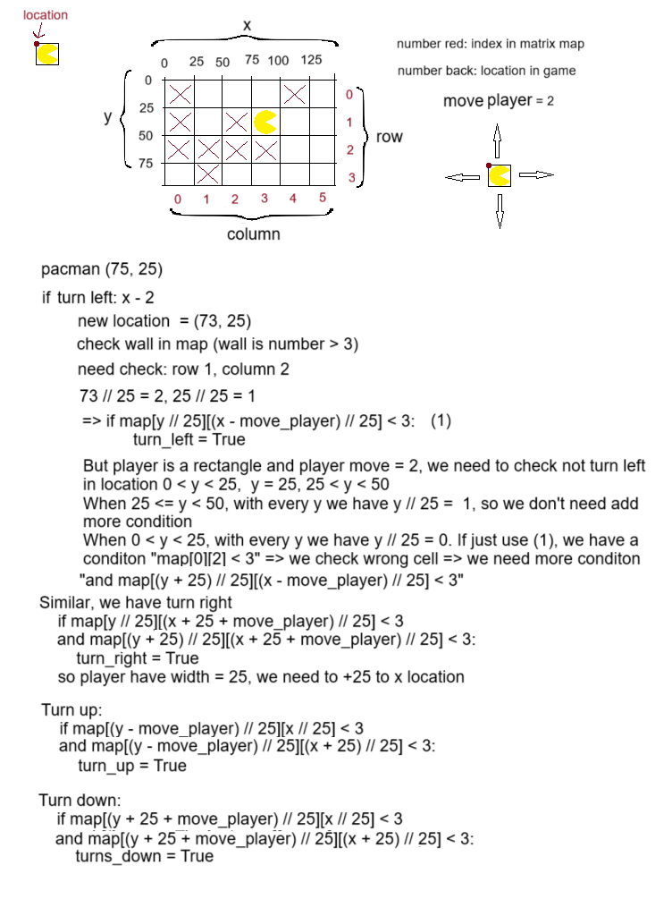
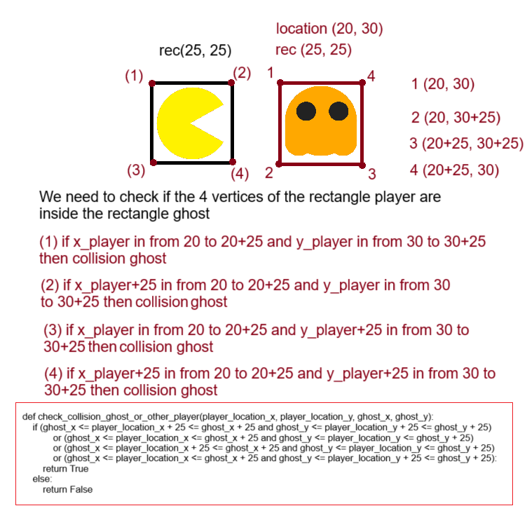

# Pacman Game with Socket

## Giới thiệu

Đây là dự án tạo trò chơi Pacman sử dụng kết nối socket để cho phép nhiều người chơi cùng tham gia trò chơi. Trò chơi sẽ được viết bằng Python.

## Hướng dẫn cài đặt Python trên Linux

### Kiểm tra Python có sẵn hay không

Trên hầu hết các bản phân phối Linux, Python thường đi kèm sẵn. Bạn có thể kiểm tra phiên bản Python hiện tại bằng cách mở Terminal và chạy lệnh sau:

```bash
python3 --version
```
Nếu Python đã được cài đặt, bạn sẽ thấy phiên bản của nó xuất hiện. Nếu không, bạn sẽ nhận được một thông báo lỗi.

### Cài đặt Python
Nếu Python chưa được cài đặt trên hệ thống của bạn, bạn có thể sử dụng trình quản lý gói của bản phân phối Linux của mình để cài đặt Python.

Ví dụ với Ubuntu/Debian
Mở Terminal và chạy các lệnh sau:

```bash
sudo apt update
sudo apt install python3
```

Ví dụ với Fedora
Mở Terminal và chạy các lệnh sau:

```bash
sudo dnf install python3
```

Sau khi cài đặt hoàn tất, kiểm tra lại phiên bản Python để đảm bảo rằng nó đã được cài đặt thành công:
```bash
python3 --version
```

## Cài đặt Thư viện Pygame
Trong dự án của bạn, bạn sẽ cần cài đặt thư viện Pygame để phát triển trò chơi Pacman. Để cài đặt Pygame, bạn có thể sử dụng pip, trình quản lý gói cho Python.

```bash
pip install pygame
```

Sau khi cài đặt hoàn tất, bạn có thể kiểm tra xem Pygame đã được cài đặt thành công hay không bằng cách nhập:

```bash
python3 -m pygame.examples.aliens
```

Nếu Pygame đã được cài đặt đúng cách, bạn sẽ thấy một cửa sổ mới mở ra hiển thị một trò chơi mẫu.


## Tải mã nguồn từ github

```bash
git clone https://github.com/dolehuy00/PacmanGameWithSocket.git
```

# Khởi động Trò Chơi
Mở Terminal và di chuyển đến thư mục chứa mã nguồn của trò chơi. Chạy lệnh để khởi động
trò chơi Pacman.
## Chạy server

```bash
python server_data_udp.py
python server_chat_tcp.py
```

##  Chạy client

```bash
 python client_1.py
```

# Chơi Trò Chơi

Sau khi trò chơi khởi động, màn hình chờ sẽ được hiển thị, tại đây bạn có thể nhập tên của mình trước khi vào phòng. Sau đó bạn có thể nhấn enter hoặc nút "Start" để bắt đầu vào phòng chơi.

Trong quá trình chơi trò chơi Pacman, có một số tình huống xảy ra như sau:

1. **Pacman Ăn Một Viên Gạch:** Khi Pacman đi qua một viên gạch, viên gạch sẽ biến mất và người chơi sẽ nhận được điểm số tương ứng.

2. **Pacman Tiếp Xúc Với Ma:** Nếu Pacman tiếp xúc với một con ma, có thể xảy ra:
   - Nếu ma đang ở trạng thái làm chậm (sau khi bạn ăn được viên gạch lớn), Pacman sẽ ăn được ma và ma sẽ được đưa về chuồng giữa bản đồ, bạn sẽ được cộng điểm.
   - Nếu ma không ở trạng thái làm chậm, Pacman sẽ bị mất mạng và được dịch chuyển đến vị trí ngẫu nhiên, đồng thời mất nửa số điểm hiện có.

3. **Pacman Tiếp Xúc Với Người Chơi Khác:** Nếu Pacman tiếp xúc với một người chơi khác, có thể xảy ra:
   - Nếu người chơi khác đang đang ở trạng thái suy yếu (có màu xanh) (sau khi bạn ăn được viên gạch lớn), bạn sẽ tiêu diệt được người chơi khác, họ sẽ bị đưa đi vị trí ngẫu nhiên, bạn sẽ cướp được nửa số điểm của họ.
   - Nếu người chơi khác không ở trạng thái suy yếu hoặc cả 2 đểu bị suy yếu, thì không có việc gì xảy ra cả.

4. **Pacman Ăn Viên Gạch Năng Lượng (Thức Ăn Lớn):** Khi Pacman ăn một viên gạch năng lượng, nó sẽ trở thành "siêu phẩm" trong một khoảng thời gian ngắn, có khả năng ăn được các con ma mà không bị tấn công và làm suy yếu các người chơi khác.

5. **Ăn Hết Các Viên Gạch:** Nếu Pacman ăn hết tất cả các viên gạch trên màn hình, trong khoảng 30 giây tiếp theo trò chơi sẽ tự động sinh ra các viên gạch mới và người chơi có thể đoạt được các viên gạch lớn để tối ưu số điểm của mình.

### Màn hình chờ của trò chơi


### Màn hình chính của trò chơi


### Khi tham gia nhiều người


### Khi người chơi bị suy yếu


### Khung điểm số


### Khung trò chuyện


### Cơ chế kiểm tra va chạm với tường


### Cơ chế kiểm tra va chạm với ma
